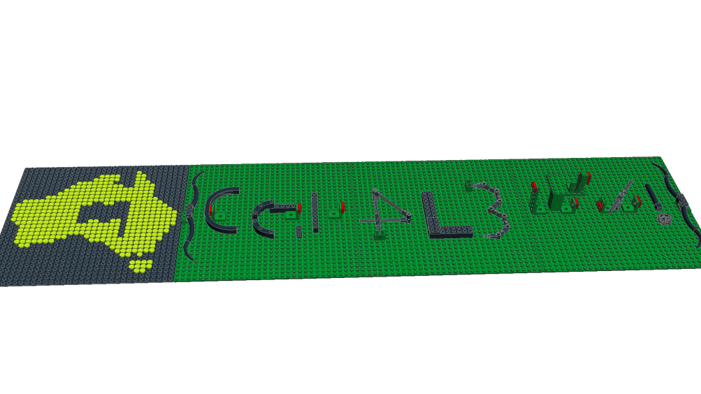
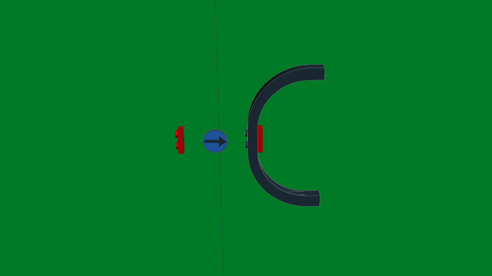
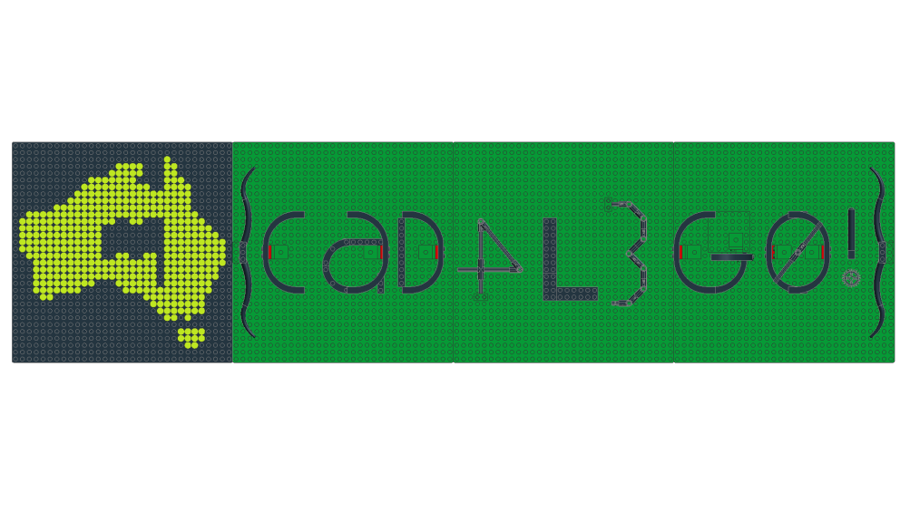

# Walkthrough - Builder

You're presented with `builder.mpd`.
Whatever `.mpd` is.
Inspecting the file you can see that it's readable text:

```
$ head builder.mpd
0 FILE challenge.ldr
0 Name: challenge.ldr
1 0 -960 0 0 1 0 0 0 1 0 0 0 1 DUCTF_logo.ldr
1 2 -320 0 0 1 0 0 0 1 0 0 0 1 3811.dat
1 0 -620 -12 0 1 0 0 0 1 0 0 0 1 brace.ldr
1 0 -552 -38 0 0 1 0 0 0 1 1 0 0 6184.dat
1 2 -500 -8 0 0 0 1 0 1 0 -1 0 0 3956.dat
1 4 -536 -38 0 0 1 0 0 0 -1 -1 0 0 3023.dat
1 0 -300 -24 -40 0 0 1 0 1 0 -1 0 0 48092.dat
1 0 -260 -24 30 1 0 0 0 1 0 0 0 1 3009.dat
```

It's clearly something that's designed for a computer to read.
Searching for `mpd ldr dat` should lead you to [ldraw.org](https://www.ldraw.org), where you can read about the LDraw file format and system of tools - it's a whole ecosystem of applications, utilities and an extensive parts library so that you can build digital LEGO models on your computer.

Ok, so now you know what it is, you probably want to see what LEGO model you've been given.
So follow the "Getting Started" section of the website through to your OS of choice, to download the parts library and an editor.

When you open the file, you're presented with , which looks _almost_ like a flag.
There's the DUCTF logo, and a couple of letters and numbers surrounded by braces, but it's clearly incomplete.
Looking around the model, you see something interesting hidden underneath the baseplates.


So, everywhere you see one of the red 1x2 plates, you need to add that big curved brick.
And you can see that the first one - the one that makes up the letter C - has been done for you.

So you go ahead and insert those bricks and you get something that looks much more sensible - except for that mess at the third character from the end.
All it takes is a change of perspective, and it all falls into place.


The flag is `DUCTF{CaD4L3G0!}`
