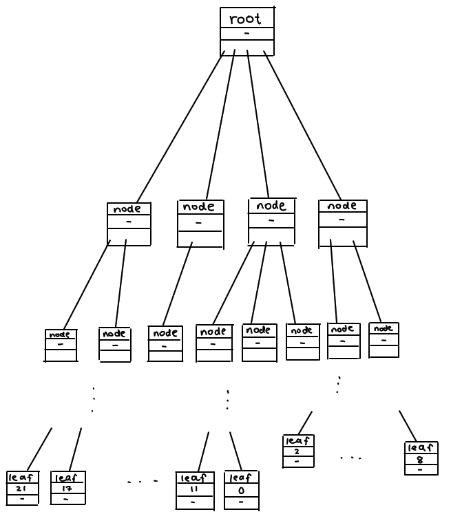
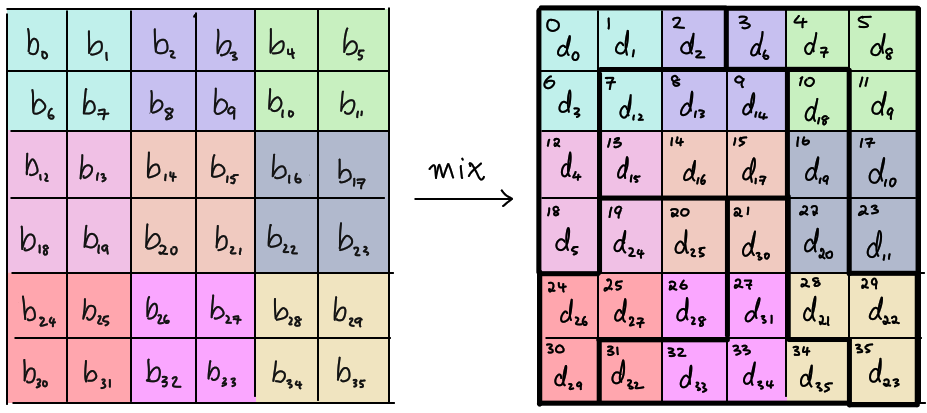

# Challenge Overview

We are given a typical flag checker binary which prompts us for the flag and prints whether or not our guess is correct. The binary is stripped, but there are not many functions and it is relatively easy to identify the core functions.

The main function looks like this (cleaned up, and other functions named appropriately - we'll get to those later):

```C
void main(void)

{
  size_t input_length;
  undefined8 tree;
  long in_FS_OFFSET;
  int i;
  int j;
  char input [40];
  undefined8 uStack16;
  
  uStack16 = *(undefined8 *)(in_FS_OFFSET + 0x28);
  init();
  printf("What\'s the flag?: ");
  fgets(input,0x25,stdin);
  input_length = strlen(input);
  if (input_length != 0x24) {
    die();
  }
  for (i = 0; i < 0x10; i = i + 1) {
    mix(input);
    tree = generate_tree(input);
    permute(input,tree);
  }
  for (j = 0; j < 0x24; j = j + 1) {
    if (input[j] != (&FINAL)[j]) {
      die();
    }
  }
  puts("Correct! :)");
                    /* WARNING: Subroutine does not return */
  exit(0);
}
```

We see that the flag should be of length 36, and that it is passed through some functions 16 times before being compared to a fixed hardcoded value.

This for loop is where all the transformations seem to happen:

```C
  for (i = 0; i < 0x10; i = i + 1) {
    mix(input);
    tree = generate_tree(input);
    permute(input,tree);
  }
```

We'll go through each of these functions.

## Mixing Step

The function at `0x19fa` (which we named `mix`) defines six different arrays containing six integers as follows:

```C
  int c0[6] = {0, 1, 2, 6, 12, 18};
  int c1[6] = {3, 4, 5, 11, 17, 23};
  int c2[6] = {7, 8, 9, 13, 14, 15};
  int c3[6] = {10, 16, 22, 28, 29, 35};
  int c4[6] = {19, 20, 24, 25, 26, 30};
  int c5[6] = {21, 27, 31, 32, 33, 34};
```

and then calls another function, at `0x17f0` (which we will call `mix_column`) six times, each with the input and one of the above int arrays:

```C
  mix_column(input,c0);
  mix_column(input,c1);
  mix_column(input,c2);
  mix_column(input,c3);
  mix_column(input,c4);
  mix_column(input,c5);
```

The `mix_column` function itself makes extensive use of another function at `0x17c3` (which we will just call `m`) that performs some simple bit operations on its input:

```C
uint m(byte param_1)
{
  return (uint)(param_1 >> 7) * 0x1b ^ (uint)param_1 * 2;
}
```

Back to the `mix` function, we see that it modifies the input in-place with the index being decided by the second argument (the array of six integers). We can notice that all of the integers defined in `c0`, `c1`, ..., `c5` cover all the integers from `0` to `35`, so it seems like this function simply transforms these "chunks" of the input independently.

The modified value itself is calculated as the XOR sum of some combination of the original inputs and `m` applied to the original inputs.

## Tree Generation

The function at `0x1232` (which we named `generate_tree`) allocates a bunch of memory and randomly populates it with data based on the input. We can see that a custom rand function is being used which is just a simple LCG, and it is seeded at the start of the `generate_tree` function, so since this function doesn't use any other global variables, it should be deterministic and always output the same value for a given input.

Obviously, we don't have function names so appropriately naming this function `generate_tree` was done in hindsight. But we can gather some information that leads us to this conclusion about the function by looking at what it actually does. For a rough overview; it allocates a large chunk (an array) of memory and another chunk of size 16, setting the first entry of the array to this size 16 value. It then iterates for 256 iterations taking the "current" entry `n` and randomly choosing a number `r` between 0 and 4 and making `r` further allocations of size 16, adding these new values to `n` (specifuically, the latter 8 bytes of `n` which seems to be an array by its usage) as well as the array. Then, it loops through every non-null entry in the array and assigns the first 8 bytes a random element of the input.

Conceptually, the data structure looks something like this:



## Permutation Step

The final function called in the main loop is the `permute` function which takes as arguments the (current transformed) input, and the root node of the tree generated in the tree generation step. Presumably, this function will transform the input in some way based on the tree structure. Once again, deciding to name this function `permute` was done in hindsight, but if we look at the function itself (at `0x1413`) we see that its behaviour is quite simple:

```C
void permute(undefined *input,long root)
{
  *input = *(undefined *)(root + 0x2730);
  input[1] = *(undefined *)(root + 0x5b00);
  input[2] = *(undefined *)(root + 0x370);
  input[3] = *(undefined *)(root + 0x6f0);
  input[4] = *(undefined *)(root + 0x3120);
  input[5] = *(undefined *)(root + 0x3370);
  input[6] = *(undefined *)(root + 0x32d0);
  input[7] = *(undefined *)(root + 0x57b0);
  input[8] = *(undefined *)(root + 0x2ea0);
  input[9] = *(undefined *)(root + 0x1750);
  input[10] = *(undefined *)(root + 0x440);
  input[0xb] = *(undefined *)(root + 0x5b0);
  input[0xc] = *(undefined *)(root + 0x4b90);
  input[0xd] = *(undefined *)(root + 0x310);
  input[0xe] = *(undefined *)(root + 0x2f10);
  input[0xf] = *(undefined *)(root + 0x4ac0);
  input[0x10] = *(undefined *)(root + 0x1bf0);
  input[0x11] = *(undefined *)(root + 0x3690);
  input[0x12] = *(undefined *)(root + 0x1580);
  input[0x13] = *(undefined *)(root + 0x1620);
  input[0x14] = *(undefined *)(root + 0x4480);
  input[0x15] = *(undefined *)(root + 0x3520);
  input[0x16] = *(undefined *)(root + 0x1840);
  input[0x17] = *(undefined *)(root + 0x1e20);
  input[0x18] = *(undefined *)(root + 0x1330);
  input[0x19] = *(undefined *)(root + 0x48d0);
  input[0x1a] = *(undefined *)(root + 0x1d40);
  input[0x1b] = *(undefined *)(root + 0x3930);
  input[0x1c] = *(undefined *)(root + 0x2fb0);
  input[0x1d] = *(undefined *)(root + 0x27b0);
  input[0x1e] = *(undefined *)(root + 0x5b80);
  input[0x1f] = *(undefined *)(root + 0x2f30);
  input[0x20] = *(undefined *)(root + 8000);
  input[0x21] = *(undefined *)(root + 0x4b00);
  input[0x22] = *(undefined *)(root + 0x3650);
  input[0x23] = *(undefined *)(root + 0x2ef0);
  return;
}
```

It modifies every character of our input by replacing it with some fixed offset from the root node via an out of bounds access. Since the leaves in the tree structure contain values taken from the input, we may presuppose that this function replaces the input characters with other input characters (and furthermore that it indeed is a permutation, otherwise it may not be invertible and the challenge may not be solvable).

## Flag Check

After 16 rounds of mixing and permuting, the transformed input is compared to the hardcoded byte string

```
0f4f733c41c6a4afb441d665c899aab36c99613c4edd704615663c1b7f16a66f2313126e
```

which can be easily extracted from the binary. The goal is to find an input that, when transformed, is equal to this string.

# Solution

Since the input is mixed before being permuted, when reversing the operations we need to perform the inverse permutation first, and then the inverse mix. So we'll start by analysing the permutation even further and seeing how it can be inverted.

## Permutation Step

To figure out exactly where the permutation sends inputs to, we need to analyse the values contained in the leaves of the tree and their offset from the root node. Since the randomness is seeded at the start of the tree generation, the permutation step is the same every time (in the sense that it sends the same positions to the same different positions every time it is called). Because of this, dynamic analysis is an easy and viable step to figuring out what the permutation is exactly. To make it easier to read, we can send an input of 36 unique characters, then skip over the `mix` function (using a debugger) and then inspect the input just after the `permute` function returns and note how the characters have shuffled around. Doing so, we see that the permutation looks something like this:


As an alternative to dynamic analysis, we could try to reimplement the tree generation logic and compute the values at the given hardcoded offsets to determine the permutation.

Computing the inverse of a permutation is easy; in the above image we see that `m[0]` is mapped to `m[23]` and `m[1]` is mapped to `m[16]`. To go the other way, we would simply map `m[23]` to `m[0]` and `m[16]` to `m[1]`.

## Mixing Step

The core function `m` of the mix step is a very special one. In fact, if you paste the implementation in Google you might find some useful information about it. The implementation is repeated here for convenience (a slightly cleaned up version):

```C
byte m(byte b) {
  return (b << 1) ^ (((b >> 7) & 1) * 0x1b);
}
```

It is possible to note that the mixing functions have a cyclic nature (whatever that means) and that the inverse can be found by playing with the bits and performing XORs and applying `m` similarly to how it is done in the binary (except changing the number of times it is done). There is another elegant solution however which uses some theory of [finite fields](https://en.wikipedia.org/wiki/Finite_field) (which is _basically_ just a finite set of numbers, nothing to be scared of!).

The key thing is to notice that `m` is equivalent to a multiplication in $K = GF(2)[\alpha]/(\alpha^8 + \alpha^4 + \alpha^3 + 1) \cong GF(2^8)$. There are exactly 256 elements in the finite field $K$. These elements are $0, 1, \alpha, 1 + \alpha, \ldots$. In general, an element in $K$ is of the form:

$$
b_0 + b_1 \alpha + b_2 \alpha^2 + \cdots + b_7 \alpha^7
$$

where $b_i$ is either $0$ or $1$. You might notice there is a very close resemblance between this representation and the representation of bytes as binary digits. Indeed, there is a very natural mapping between elements in $K$ and bytes (integers from 0 to 255) which is exactly that; the above element would represent the integer whose least significant bit is $b_0$ and whose most significant bit is $b_7$. Because it is a lot easier to write integers as opposed to polynomials in $\alpha$, we write integers for convenience (but we understand that they are elements of $K$).

As we will now see, the implementation of `m` is equivalent to multiplication by $\alpha$ (which is $2$ when represented as an integer). Let

$$
b = b_0 + b_1 \alpha + b_2 \alpha^2 + \cdots + b_7 \alpha^7
$$

Then,

$$
\begin{aligned}
    \alpha b &= \alpha (b_0 + b_1 \alpha + \cdots + b_7 \alpha^7) \\
             &= b_0 \alpha + b_1 \alpha^2 + \cdots + b_7 \alpha^8 \\
             &= b_0 \alpha + b_1 \alpha^2 + \cdots + b_7 (\alpha^4 + \alpha^3 + \alpha + 1) \\
             &= b_7 + (b_0 + b_7) \alpha + b_1 \alpha^2 + (b_2 + b_7) \alpha^3 + (b_3 + b_7) \alpha^4 + b_4 \alpha^5 + b_5 \alpha^6 + b_6 \alpha^7
\end{aligned}
$$

Comparing this with the implementation of `m`:

```C
byte m(byte b) {
  return (b << 1) ^ (((b >> 7) & 1) * 0x1b);
}
```

(noting that `0x1b = 0b00011011`) we see that the `(b << 1)` part is equivalent to shifting all of the $b_i$ up by one so that $b_0$ is multiplied with $\alpha$, and $b_1$ with $\alpha^2$, etc. And the `((b >> 7) & 1) * 0x1b` part is equivalent to the modulo reduction which adds $b_7$ (the most significant bit) as coefficients of $1, \alpha, \alpha^3$ and $\alpha^4$.

Furthermore, addition of elements in $K$ is equivalent to XORing their integer representations, so with these, we can express the mix step entirely in terms of operations in $K$.

The decompilation output is annoying to read (although all the necessary information is there), so for ease of explaining, we present the source for the `mix_column` function that operates on the input and an array of six integers:

```C
void mix_column(unsigned char* input, int idxs[]) {
    unsigned char b0, b1, b2, b3, b4, b5;
    unsigned char d0, d1, d2, d3, d4, d5;
    b0 = input[idxs[0]];
    b1 = input[idxs[1]];
    b2 = input[idxs[2]];
    b3 = input[idxs[3]];
    b4 = input[idxs[4]];
    b5 = input[idxs[5]];
    d0 = b0 ^ m2(b0) ^ b2 ^ m2(b2) ^ (m2(b4));
    d1 = b1 ^ m2(b1) ^ b3 ^ m2(b3) ^ (m2(b5));
    d2 = m2(b0) ^ b4;
    d3 = m2(b1) ^ b5;
    d4 = b0 ^ m2(b0) ^ m2(b2);
    d5 = b1 ^ m2(b1) ^ m2(b3);
    input[idxs[0]] = d0;
    input[idxs[1]] = d1;
    input[idxs[2]] = d2;
    input[idxs[3]] = d3;
    input[idxs[4]] = d4;
    input[idxs[5]] = d5;
}
```

The $b_i$ are the input values (characters taken from `input` given by the specified `idxs`) and the $d_i$ are the corresponding outputs which replace the inputs after they have been computed. We have:

$$
\begin{aligned}
    d_0 &= 3 b_0 + 3 b_2 + 2 b_4 \\
    d_1 &= 3 b_1 + 3 b_3 + 2 b_5 \\
    d_2 &= 2 b_0 + b_4 \\
    d_4 &= 2 b_1 + b_5 \\
    d_5 &= 3 b_0 + 2 b_2 \\
    d_6 &= 3 b_1 + 2 b_3
\end{aligned}
$$

Recall that our goal is to invert this operation; that is, take the $d_i$ and return back the $b_i$. If we represent this system of equations as a matrix multiplication, it becomes clear how to do that:

$$
\begin{bmatrix}
d_0 \\ d_1 \\ d _2 \\ d_3 \\ d_4 \\ d_5
\end{bmatrix}
=
\begin{bmatrix}
    3 & 0 & 3 & 0 & 2 & 0 \\
    0 & 3 & 0 & 3 & 0 & 2 \\
    2 & 0 & 0 & 0 & 1 & 0 \\
    0 & 2 & 0 & 0 & 0 & 1 \\
    3 & 0 & 2 & 0 & 0 & 0 \\
    0 & 3 & 0 & 2 & 0 & 0 \\
\end{bmatrix}
\begin{bmatrix}
b_0 \\ b_1 \\ b _2 \\ b_3 \\ b_4 \\ b_5
\end{bmatrix}
$$

So to go from the $d_i$ to the $b_i$, we simply multiply by the inverse of this matrix:

$$
\begin{bmatrix}
b_0 \\ b_1 \\ b_2 \\ b_3 \\ b_4 \\ b_5
\end{bmatrix}
=
\begin{bmatrix}
    3 & 0 & 3 & 0 & 2 & 0 \\
    0 & 3 & 0 & 3 & 0 & 2 \\
    2 & 0 & 0 & 0 & 1 & 0 \\
    0 & 2 & 0 & 0 & 0 & 1 \\
    3 & 0 & 2 & 0 & 0 & 0 \\
    0 & 3 & 0 & 2 & 0 & 0 \\
\end{bmatrix}^{-1}
\begin{bmatrix}
d_0 \\ d_1 \\ d_2 \\ d_3 \\ d_4 \\ d_5
\end{bmatrix}
$$

The last thing to figure out is which input characters are being used as the $b_i$ in each call to `mix_column`. This is specified by the `ci` integer arrays in `mix` function as discussed before. Pictorially, the grouping looks like this:



## Inverting the Output

To recover the correct input, we simply run the hardcoded check value through 16 rounds of inverse permutations and inverse mixing steps. At the end, we should find the flag :)
